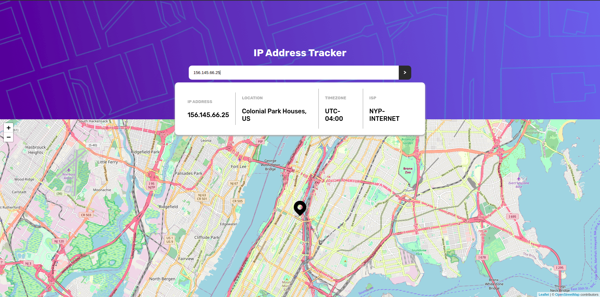

## Table of contents

- [Overview](#overview)
  - [The challenge](#the-challenge)
  - [Screenshots](#screenshots)
  - [Links](#links)
- [My process](#my-process)
  - [Built with](#built-with)


## Overview

### The challenge

Users should be able to:

- Login using SAWO sdk (the passwordless way)
- View the optimal layout for each page depending on their device's screen size
- See hover states for all interactive elements on the page
- See their own IP address on the map on the initial page load
- Search for any IP addresses or domains and see the key information and location

### Screenshots




### Links

- Solution URL: [https://github.com/charan1973/ip-address-tracker](https://github.com/charan1973/ip-address-tracker)
- Live Site URL: [https://ip-address-sawo.herokuapp.com/](https://ip-address-sawo.herokuapp.com/)

## My process

### Built with

- React
- Express
- MongoDB
- Mongoose
- Ipify
- Sawo

### Flow
The app contains 2 pages. Login and a Home. Login page integrates Sawo for the easy and passwordless sign in and the verified user data is stored in the mongodb using express. The data stored also contains the current user's IP address. 

A single document in the MongoDB would look like:
```
{
  _id: "60a8030a914ae55e829ee690",
  identifier: "+917010427559",
  identifierType: "phone_number_sms",
  sawoUserId: "06c5e4c6-b74e-4980-90a0-5195da859a12",
  userIp: "120.138.15.153"
}
```

**Note: The user's IP is sent to the backend via API and with the help of Ipify.**

Once the user is logged in they will be redirected to the Home page. Home page is a private route meaning user's who aren't logged in cannot access the screen. 

Home page has a search input, a info card and map box itself. When the user first visits the home they'll be treated default with their ip address information. Then they can use the search functionality to search for new ip address.